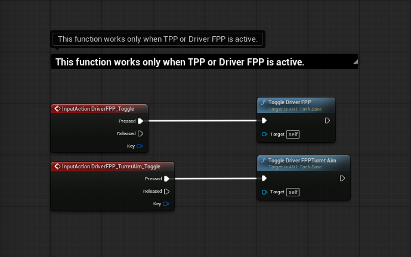
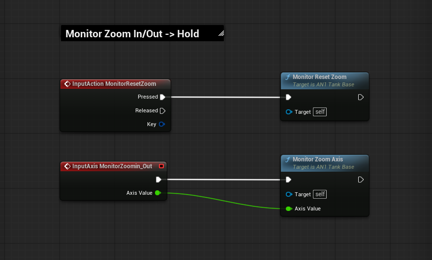
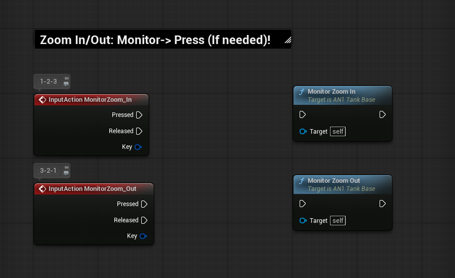

# AN1 Inputs / Keybinds (Blueprint Wiring Screenshots)

These screenshots show the example `BP_Tank` input wiring.

> Project Settings → Input mapping list is in `README.md`.

---

## Wiring Screenshots

### 1

### 2

### 3

### 4

### 5

### 6

### 7

### 8

### 9

