# AN1 Montage Gallery (More)

This page contains extra overview/montage screenshots (for GitHub reference).
Fab has a 24-image limit, so not all of these are used on the store page.

---

## Plugin / Setup

---

## Inputs / Blueprint Wiring

---

## Movement

---

## Aim / Camera / Monitor
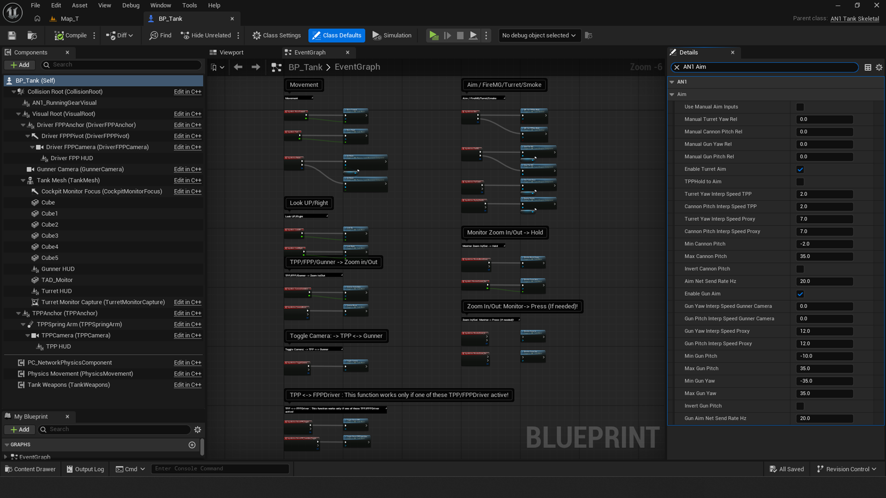

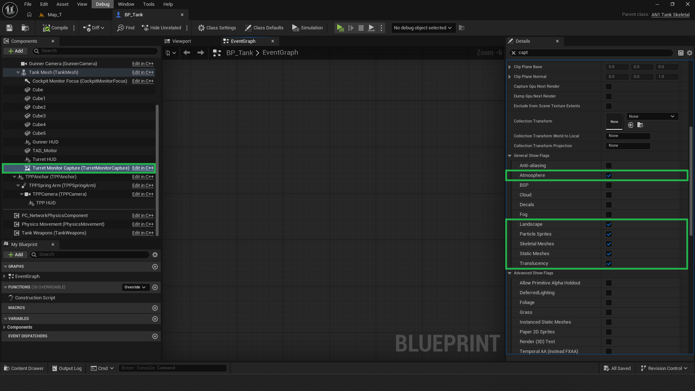

---

## Weapons / FX

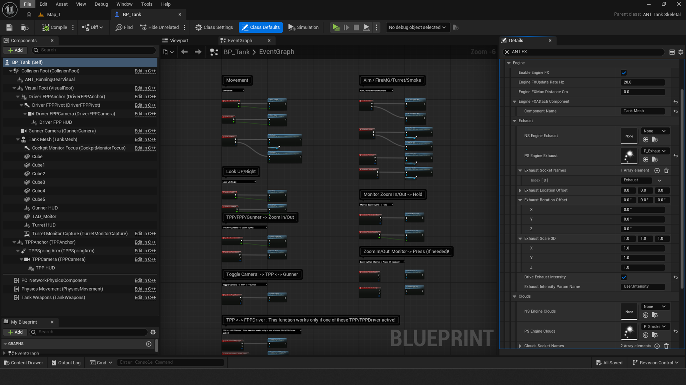
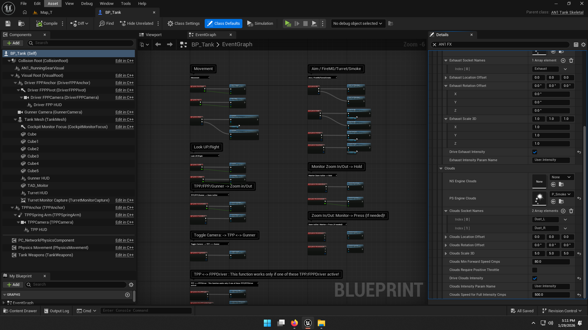
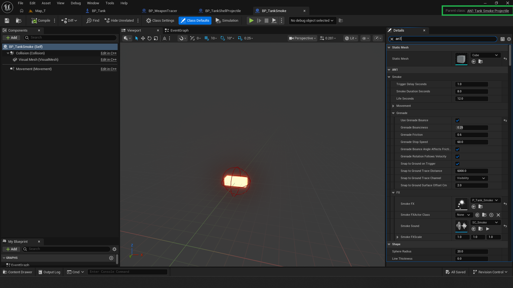
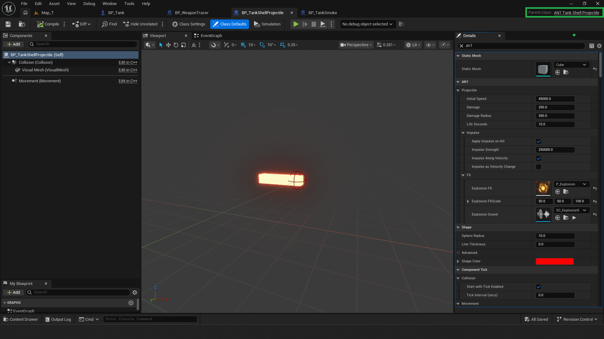
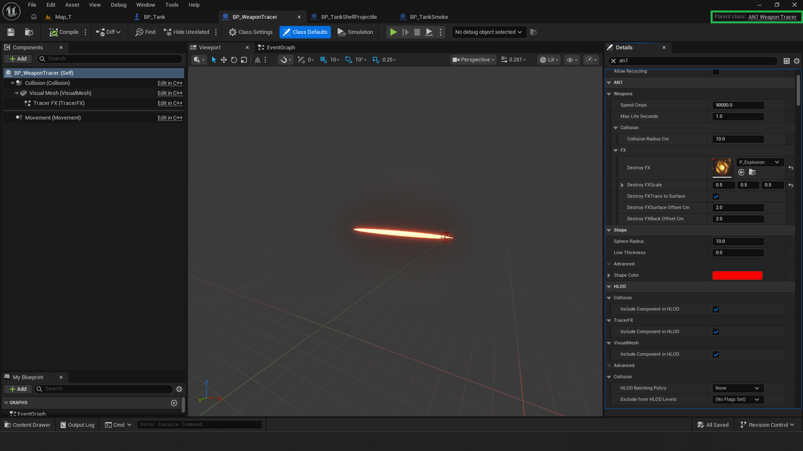

---

## Animation

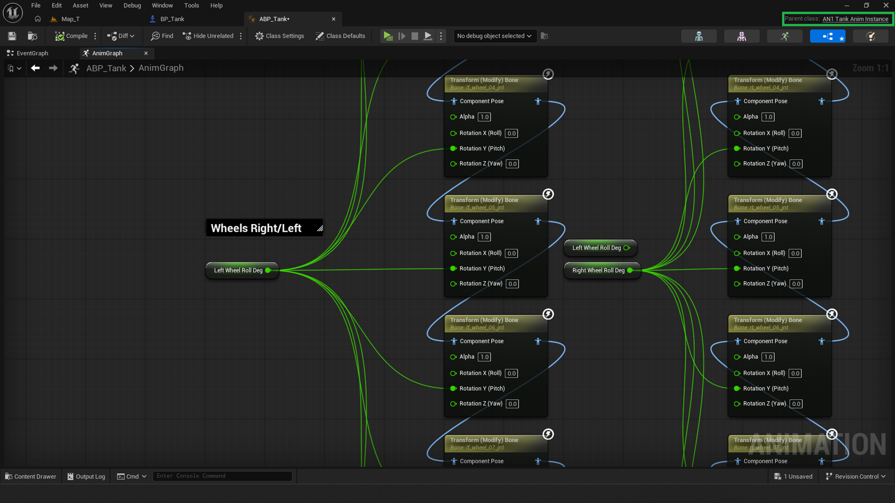
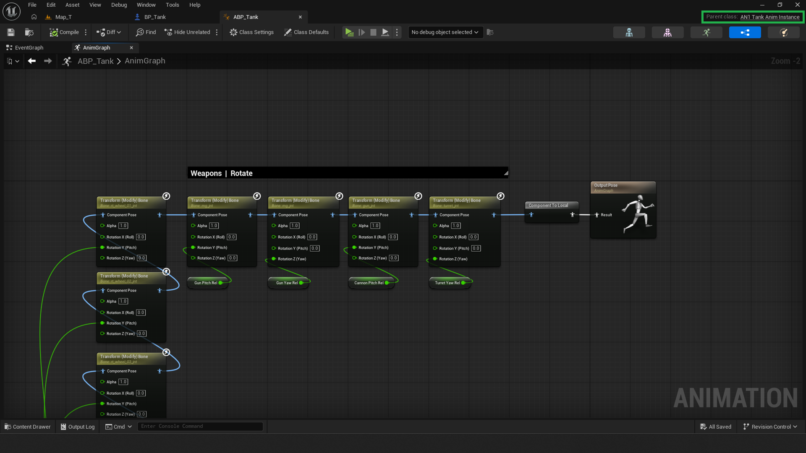
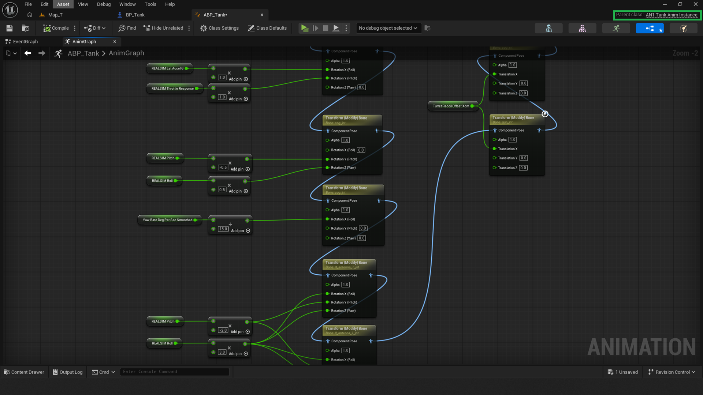

---

## Running Gear / Tracks

---

## HUD / Audio

---

## Multiplayer / Editor Settings

---

## Misc

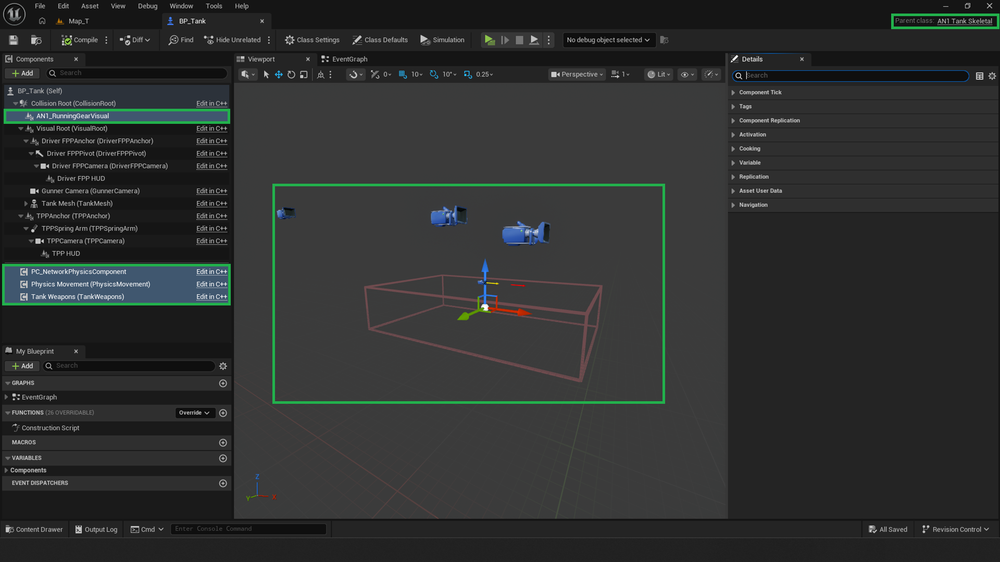
