# AN1 Settings Reference (Screenshots)

This page is a visual reference of the default AN1 settings shown in the example tank project (UE 5.7).

---

## Aim & Camera
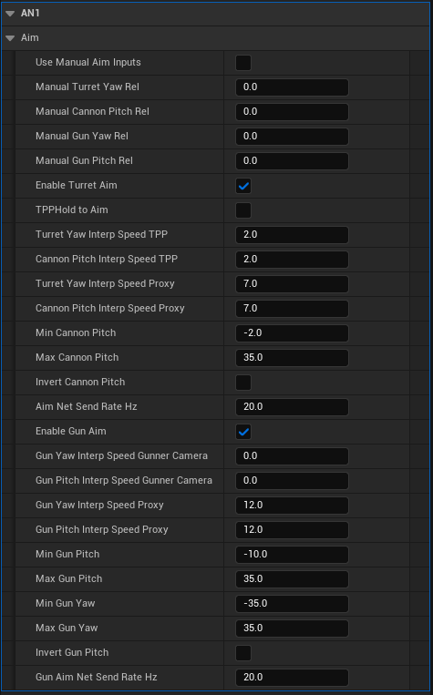

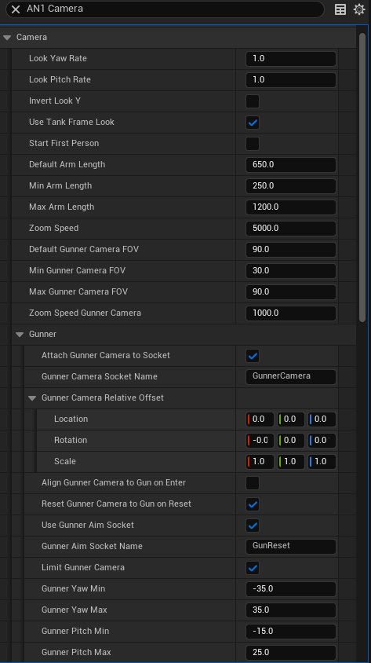

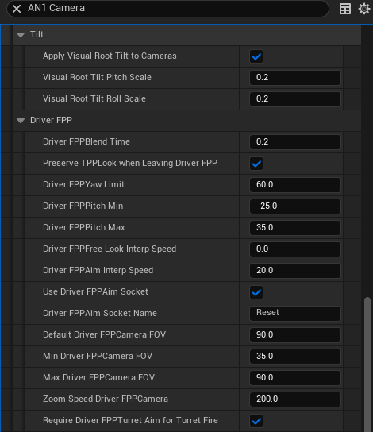

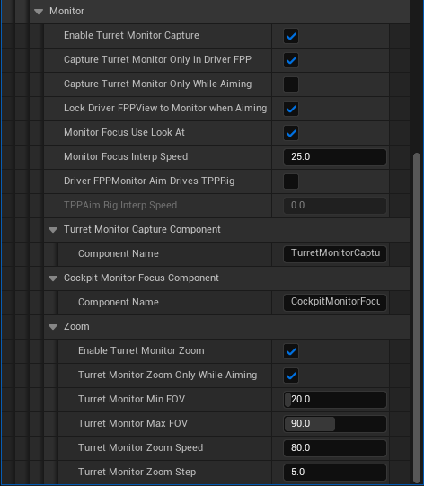

---

## Movement
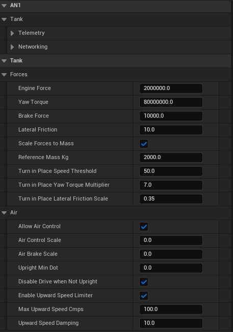

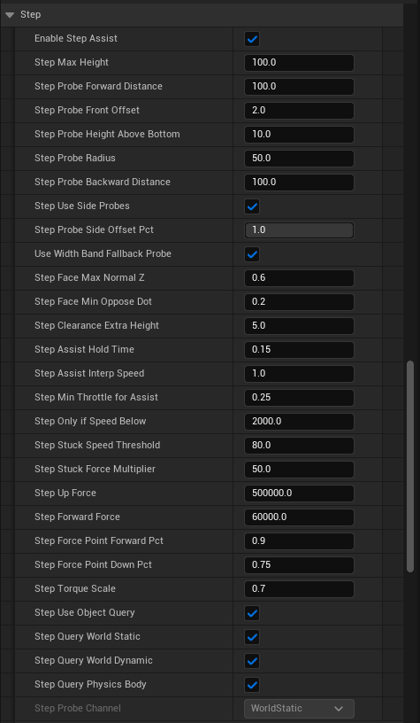

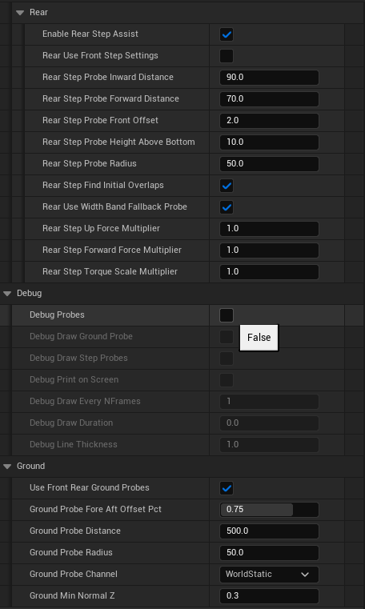

---

## Weapons
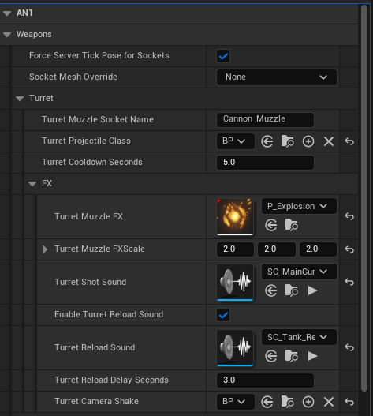

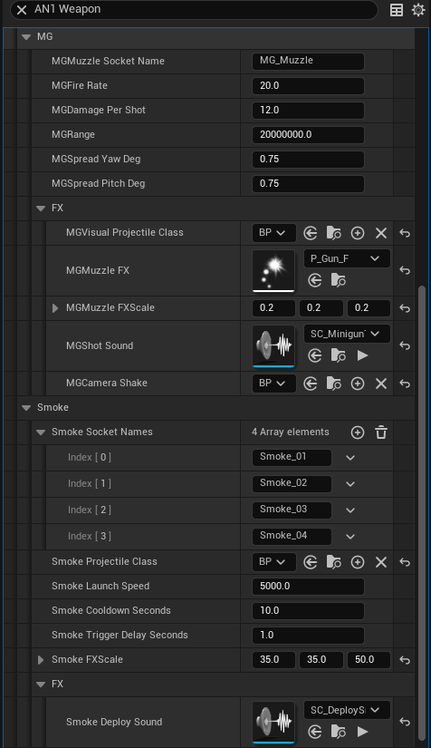

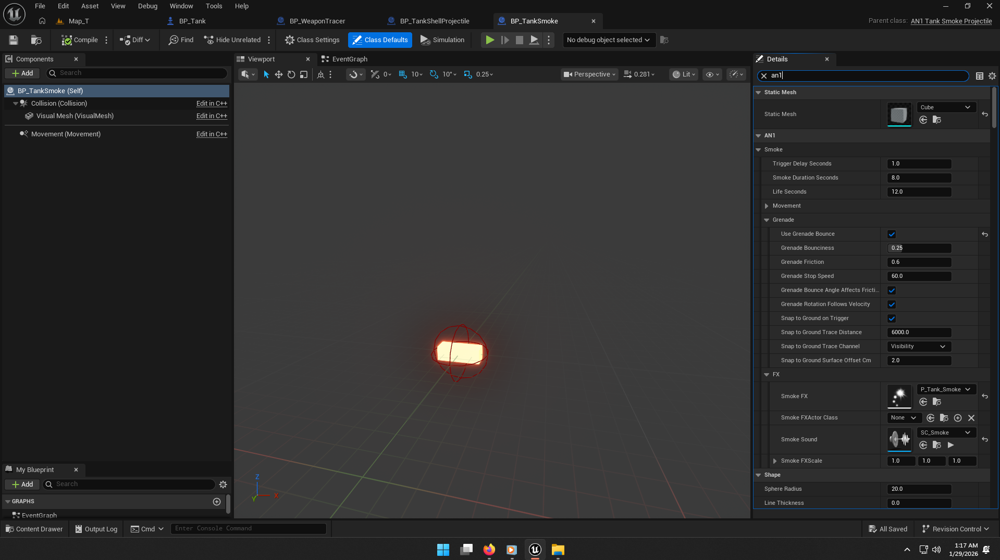

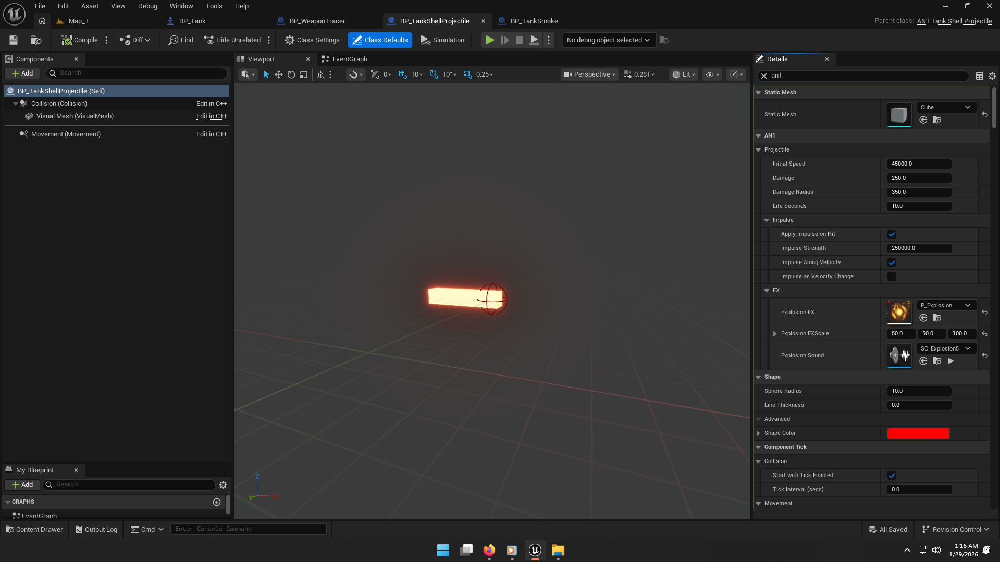

---

## Tracks
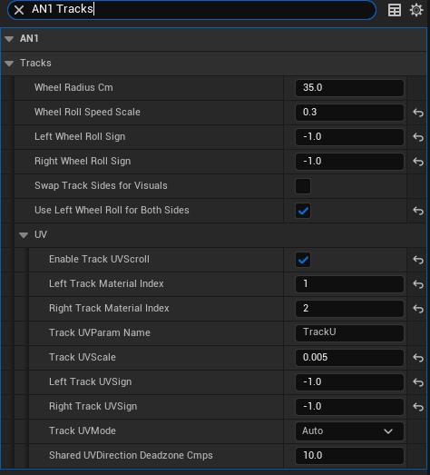

---

## Running Gear Visual
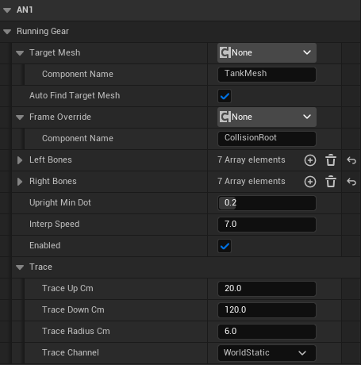

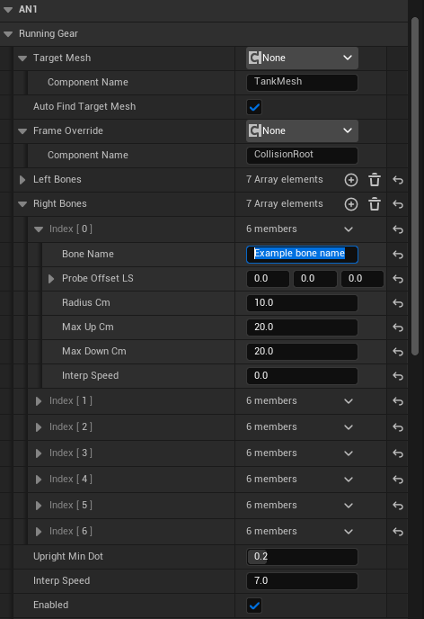

---

## HUD
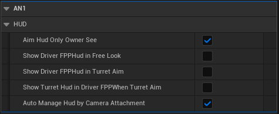

---

## Audio

---

## Example Tank

